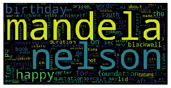

Nelson Rolihlahla Mandela, whose name of Xhosa origin means”to pull the branch of a tree” (interpreted by the natives as “troublemaker”), and universally known as Nelson Mandela or Madiba.

Mandela was born on July 18, 1918, in Mvezo, South Africa, in the small town of Mvezo in the O.R. Tambo district of the Eastern Cape, on the banks of the Mbashe River near Umtata. He died on 5 December 2013 at the age of 95.
              
   >  “EDUCATION IS THE MOST POWERFUL WEAPON IN THE WORLD.”


```python
# Here are all the installs and imports you will need 
# for your word cloud script and uploader widget
!pip install wordcloud
!pip install fileupload

import wordcloud
import matplotlib.pyplot as plt
```

## Read text file


```python
# read file
file_handle = open('./mandela-biograpy.txt', 'rt')

# file to list of lines
lines = []
for file in file_handle:
    lines.append(file)
```

## List of uninteresting words


```python
punctuations = '''!()-[]{};:'"\,<>./?@#$%^&*_~'''
uninteresting_words = 
[
    "we", "our", "ours", "you", "your", "yours",
    "he", "she", "him","his", "her", "hers", "its",
    "they", "them","their", "what", "which", "who",
    "whom", "this", "that", "am", "are","was", "were",
    "be", "been", "being","have", "has", "had", "do",
    "does", "did", "but", "at", "by", "with","from",
    "here", "when", "where", "how", "all", "any",
    "both", "each", "few", "more", "some", "such",
    "nor", "too", "very", "can", "will", "just",
    "the", "a", "to", "if", "is", "it", "of", "and",
    "or", "an", "as","i", "me", "my", "in", "no"
]
```

## Remove uninteresting words and count the words in the list

```python
letter_count = dict()
final_text = list()

for line in lines:
    for word in line.split():
        text = str()

        for letter in word.lower():
            if letter not in punctuations: 
                if letter.isalpha():
                    text += letter
        if word not in uninteresting_words:
            final_text.append(text)

for word in final_text:
    if word not in letter_count:
        letter_count[word] = 0
    letter_count[word] += 1
```

## Work with wordcloud

```python
cloud = wordcloud.WordCloud()
cloud.generate_from_frequencies(letter_count)
image = cloud.to_array()
```

## Work with Matplotlib and show image

```python
# matplotlib
plt.imshow(image, interpolation = 'nearest')
plt.axis('off')
plt.show()
plt.savefig('mandela-wordcloud.png')
```


