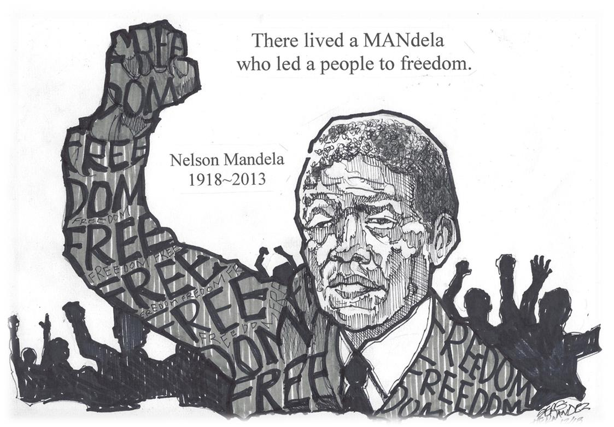

# Lets create a word cloud image for Nelson Mandela
Nelson Rolihlahla Mandela, whose name of Xhosa origin means”to pull the branch of a tree” (interpreted by the natives as “troublemaker”), and universally known as Nelson Mandela or Madiba.

Mandela was born on July 18, 1918, in Mvezo, South Africa, in the small town of Mvezo in the O.R. Tambo district of the Eastern Cape, on the banks of the Mbashe River near Umtata. He died on 5 December 2013 at the age of 95.

<!--  -->

[Picture Source Link](http://theavtimes.com/wp-content/uploads/2013/12/Mandela-sketch.jpg)

His father was Gadla Henry Mphakanyiswa, tribal chief and adviser to the monarch of Tembuland, his mother Nosekeni Fanny, a member of the Xhosa amaMpemvu clan, was Gadla’s third wife and a member of the right-hand House lineage.

Nelson Mandela was one of 13 children his father had with four different wives, a lawyer, anti-apartheid activist, South African politician, and philanthropist.

### Beginning of Mandela’s life
 He had a happy childhood listening to stories of his people, when they were free, before the arrival of the whites. 
 The first years of his life were determined by custom, ritual, and taboo. He grew up with two sisters in his mother’s kraal, and at the age of seven, his mother sent him to a Methodist school. 
 According to the Foundation that bears his name, he reported that the name”Nelson” came from his teacher, Miss Mdingane, who named him”Nelson” on the first day of school at the Qunu village school, and it is not known why he chose that name in particular.

### Father’s death
 After his father’s death, his mother took him to Mqhekezweni Palace where he was placed underthe  curatorship of Regent Jongintaba Daindyebo and his wife Noengland.
 For many years he stopped seeing his mother, but with Jongintaba and his wife he felt verywell as  they treated him as their own son.
 Mandela attended religious services every Sunday, Christianity became an important part ofhis  life.
 In addition, he went on a Methodist mission near the palace where he studied English andXhosa as  well as history and geography, and from those years onwards his love of Africanhistory began.

### The Studies
 In 1939, Nelson Mandela entered Fort Hare University, the nation’s only college for blacks, at the time. 
 In 1940 his studies were interrupted for supporting a student protest at the university that confronted him with possible expulsion. 
 That same year he decides to flee to Johannesburg, because of his guardian’s decision to marry him to a girl with whom he was not in love. 
 When Mandela arrived in the city, he found a job as a night watchman at the Crown Mining Complex where he was fired when they discovered he was a fugitive.

 He also came into contact with the African National Congress (ANC); at the end of 1941, he received a visit from Jongintaba who forgave him for having fled. And in 1942 he returned to Fort Hare University and graduated with a law degree.

### The Youth League
 In 1943 he founded the Youth League and organized numerous protests against apartheid.
 Through strikes and other non-violent protests, his name began to be heard more and more. 
 For its part, the government repressed the protesters with blood and violence, and that’s when Mandela resorted to armed struggle. 
 In 1943, Nelson Mandela resumed his higher education studies, enrolling in a correspondence course at the University of South Africa, to which he devoted time in the evenings. 
 When he passed the exams to obtain his B.A. degree, Mandela returned to Johannesburg to become a lawyer, which would help him to enter politics. 
 When he began his law studies at the University of the Witwatersrand, Mandela was the only black student and although he was racially discriminated against I can make many friendships between liberal and communist Europeans, as well as Jews and Hindus, including Joe Slovo, Harry Schwaz and Ruth First.

### Marriage
In October 1944, he married Evelyn Mase, a CNA activist from Engcobo, who was preparing to
become a nurse.

They had two children, the first named Madiba Thembi Thembekile born in February 1945 and
later in 1947 their daughter Mazawiki was born and died nine months later of meningitis.

Mandela enjoyed a homely life, joined by his mother and sister. This year he also helped
found the ANC Youth League, with Tambo and Walter Sisulu, to advance the fight for racial
equality.

## The Challenge Campaign
In 1952, Nelson Mandela led the Campaign for the Challenge, urging blacks to violate racialse gregation laws. 
He is convicted under the anti-Communist law, forbidden to attend meetings or leave the Johannesburg area. He passed the bar exam and, together with Tambo, founded the first black law firm in the country. 
On June 26, 1955, the Charter of Freedom was adopted, a document written in secrecy that demands the achievement of a democratic, free and multiracial society. 
On December 5, 1956, he was arrested with 155 people and tried for high treason.
By 1961 Mandela and the rest of the defendants are acquitted of the charge of high treason. 
He went underground and created the”spear of the Nation“, the armed wing of the ANC, from whichhe became commander and chief. 
A year later, he left South Africa and attended the Pan-African Conference in Addis Ababa(Ethiopia); he was also in Algeria where he received guerrilla training, then moved to London. 
When he returns, he is tried for illegal abandonment and sentenced to five years.
In 1964 at this time many African colonies had gained independence and Mandela is prosecuted forsabotage, he declares: “I am ready to die” for my country to be democratic. 
On June 12, 1964, Judge Quartus de Wet found Mandela and other activists guilty and sentencedthem to life imprisonment, they were sent to Robben Island, where they remained for 18 years.Mandela was confined to a damp cell, and with a palm, mat to sleep on.

### Captured and Convicted
 The following year he was captured and sentenced to life imprisonment. He would spend 27 years of his life there in precarious conditions; he was only allowed one visit and one letter every six months. 
 In 1969 the South African secret service prepared the assassination of Mandela in the same prison; they would simulate an escape attempt where he would be killed in the guise of a recapture. Thanks to an agent of the British Intelligence Service, this operation was prevented. 
 Even though he was in prison, his struggle did not cease. His name was being heard more and more and the struggle against’apartheid’ was constant. He became known as the most important black leader in South Africa. 
 In 1990, moderate President Frederik de Klerk released Nelson Mandela, who was 71 years old, and together they negotiated and abrogated’apartheid’ a year later.
 For this reason, in 1993 they were both awarded the Nobel Peace Prize.

### The Class A Prisoner
 Despite being in prison, Mandela was visited by well-known South African personalities.
 Since 1967 prison conditions have improved, black prisoners have been allowed to wear long pants, have been allowed recreational activities, and have improved the quality of food. 
 In 1969 his eldest son died in a car accident. In 1973 the UN declared Apartheid a crime against humanity. 
 By 1975, Nelson Mandela was considered a class A prisoner, which allowed him to have many visitors, receive correspondence and study. 
 He began to write his autobiography which he secretly sent to London and although it remained several years unpublished the prison authorities found several pages written on him which allowed his study privilege to be suspended for four years. 
 This allowed him to devote his time to gardening and reading until he resumed his law degree studies in 1980. 
 In March of the same year, journalist Percy Qoboza launched the slogan”Free Mandela”, which prompted an international campaign led by the United Nations Security Council for his release. 
 In April 1982 he was transferred to Pollsmoor Prison in Tokai, a suburb of Cape Town, with Walter Sisulu, Andrew Mlangení, Ahmed Kathrada, and Raymond Mhlaba. 
 The conditions in this prison were better, although Mandela missed the companionship and natural space next to the island. 
 On December 12, 1988, he was taken to Tygerberg hospital for having fallen ill with tuberculosis caused by the humidity of the cell and recovered, he was transferred to Victor Verster prison under better conditions.

### The Elections
 On 11 February 1990, he was released from prison after 27 years in prison. And on March 2 of the same year, he was elected Vice President of the ANC. 
 By 17 June 1991, after more than four decades, the South African parliament was repealing the law on racial segregation of the population. 
 On 6 July of that year, he was appointed a president of the African National Congress (ANC) by acclamation and replaced Oliver Tambo. 
 On May 15, 1992, he received the Prince of Asturias for International Cooperation. A year later, he received the Nobel Peace Prize. 
 On 26 April 1994, the first free elections were held in South Africa. Twenty million citizens exercised their right to vote for the first time, ending more than three hundred years of white rule by giving Mandela 62.6% of the vote. 
 On May 10, 1994, he was inaugurated as the first black president in South Africa’s history.
 Mandela launched a reconstruction and development plan to improve the living standards of black South Africans in areas such as education, housing, health, and employment. 
 He also pushed for a new constitution for the country that was finally approved by parliament in 1996. 
 In the same year, his autobiography”A Long Road to Freedom” was published in December.

### New Marriage
 In 1996 he divorced Winnie and in 1998 he remarried. In March 1999, suffering from prostate cancer, he bids farewell to Thabo Mbeki as the new president of the parliament. 
 When he retired from political life in June 1999, he devoted himself to guiding various humanitarian causes since its foundation. 
 In 2003, the Mandela Foundation launched a major international campaign to raise funds for the fight against AIDS. 
 For the year 2008, the world celebrated its 90th anniversary with a call for peace. London paid tribute to him with a macro-concert. One year later, the UN declared July 18 as its International Day. 
 In 2010, on the 20th anniversary of his release, he published “Conversations with myself”. That same year, the tragedy struck him again when his great-granddaughter Zenani, 13, died in a car accident on her way out of the World Cup opening concert.

### Death
  After suffering a prolonged respiratory infection, Nelson Mandela died on 5 December 2013 at the age of 95 in his home in Houghton, Johannesburg, the Republic of South Africa, surrounded by his family, in particular, his eldest daughter Makaziwe Mandela. 
  Mandela, before he died, said these words: “Death is inevitable. When a man has done what he considers his duty to his people and his country, he can rest in peace. I think I’ve made that effort and will, therefore, sleep through all eternity. 
  Few men have changed the course of history, as did Nelson Mandela, a tireless fighter, considered a global symbol of”Freedom and Hope” who, despite spending 27 years in prison, managed to defeat the racist apartheid regime, one of the most ruthless of the 20th century. 
  He was the first Democratic President of South Africa and marked the end of racial segregation in his country through a \textcolor{red}policy of reconciliation and social justice.

                
   >  “EDUCATION IS THE MOST POWERFUL WEAPON IN THE WORLD.”

[Nelson Mandela Biography source link](https://www.burrosabio.net/nelson-mandela-short-biography-summary/)


```python
# Here are all the installs and imports you will need for your word cloud script and uploader widget
!pip install wordcloud
!pip install fileupload

import wordcloud
import matplotlib.pyplot as plt
```

## Read text file


```python
# read file
file_handle = open('./mandela-biograpy.txt', 'rt')

# file to list of lines
lines = []
for file in file_handle:
    lines.append(file)
```

## List of uninteresting words


```python
punctuations = '''!()-[]{};:'"\,<>./?@#$%^&*_~'''
uninteresting_words = [
                       "we", "our", "ours", "you", "your", "yours", "he", "she", "him",
                       "his", "her", "hers", "its", "they", "them","their", "what", 
                       "which", "who", "whom", "this", "that", "am", "are","was", "were", 
                       "be", "been", "being","have", "has", "had", "do", "does", "did", 
                       "but", "at", "by", "with","from", "here", "when", "where", "how",
                       "all", "any", "both", "each", "few", "more", "some", "such", "no",
                       "nor", "too", "very", "can", "will", "just", "the", "a", "to", "if", 
                       "is", "it", "of", "and", "or", "an", "as","i", "me", "my", "in"
                       ]
```

## Remove uninteresting words and count the words in the list


```python
letter_count = dict()
final_text = list()

for line in lines:
    for word in line.split():
        text = str()

        for letter in word.lower():
            if letter not in punctuations and letter.isalpha():
                text += letter
        if word not in uninteresting_words:
            final_text.append(text)

for word in final_text:
    if word not in letter_count:
        letter_count[word] = 0
    letter_count[word] += 1
```

## Work with wordcloud


```python
cloud = wordcloud.WordCloud()
cloud.generate_from_frequencies(letter_count)
image = cloud.to_array()
```

## Work with Matplotlib and show image


```python
# matplotlib
plt.imshow(image, interpolation = 'nearest')
plt.axis('off')
plt.show()
# plt.savefig('mandela-wordcloud.png')
```


